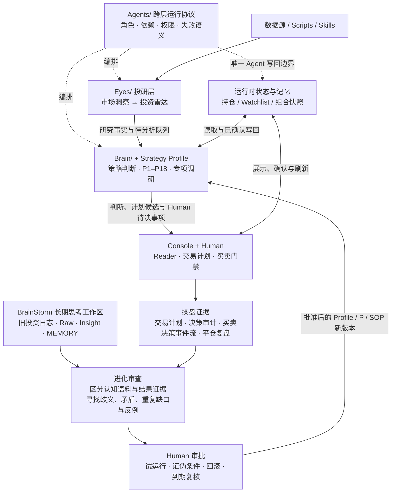

# YMOS V4 — 勇麦的投资操作系统（我给大家打个样）

**Yongmai Operating System** · Agent 时代一个支持自我进化的投资操作系统：帮你盯市场做投研，把你的策略沉淀成规则、把你的操盘变成流程、把你的决策留成证据，用真实结果反过来迭代自己。**少犯错，活得久。**

[](CHANGELOG.md)
[](LICENSE)

**简单说，YMOS 是让 AI Agent 进入你日常投资流程的一套本地工作台：**

- 它替你持续看市场、跟踪持仓与关注，把新闻、价格和研究资料压缩成**市场洞察与投资雷达**；
- 它把你原本散在脑中、笔记和临场反应里的投资逻辑，整理成 Agent 能反复执行的 **Profile、SOP 和判断规则**；
- 当你真的要行动时，它用 **Reader、交易计划、买卖门禁和复盘留痕**，帮助你按自己事先定下的逻辑走完，而不是盘中重新发明规则。

你可以先只把它当作 AI 投研系统使用，之后再逐步装入自己的策略内核和操盘习惯，不需要第一天配置完整套系统。

> **边界只有一条：YMOS 提供研究、判断与纪律支持，不提供荐股信号，也不替你自动交易；所有榜单、报告和 Agent 结论都只是输入，最终决策与结果由你负责。**

🔄 **V4 的关键变化**：保留 V3 已经跑通的投研主链，把系统进一步抽象为**投研层、策略内核层、操盘层**；新增 Skills 数据触角、Reader 与操盘工作台、Strategy Profile 和证据反馈闭环，并把「共用框架」与「勇麦个人策略」彻底掰开。框架给所有人，策略需要你自己打磨。详见 [CHANGELOG](CHANGELOG.md)。

---

## 三层：研究清楚 → 按自己的逻辑判断 → 按计划操盘

```text
       投研层        →       策略内核层       →       操盘层
   看市场、做研究          形成自己的判断          计划、门禁、执行、留痕
  Eyes + Skills       Brain + Profile + 状态       Console + Human
```

| 层 | 相当于 | 回答的问题 | 一句话 |
|:---|:---|:---|:---|
| **投研层** | 你的 AI 投研系统 | 市场发生了什么？和我的持仓、关注有什么关系？ | 负责收集、整理、监控和初始调研，把信息压缩成可用研究输入 |
| **策略内核层** | 你的投资 / 交易逻辑 | 面对这些研究事实，我怎么判断？什么时候承认自己错了？ | 决定这套系统为什么像你，而不是像作者或模型 |
| **操盘层** | 你的实际操盘逻辑 | 判断形成后，我怎样计划、过门禁、执行并留下证据？ | 把“知道”变成“做到”；最终执行权永远属于 Human |

这里的“投研层”不等于所有分析。市场洞察、数据整理、标的建档属于投研层；一旦开始根据你的 Profile 决定“该不该做、用什么裁判、何时退出”，就进入策略内核层。操盘层则不再重新发明结论，只负责把已经形成的判断转成计划、门禁和真实留痕。

> **系统没有自动交易层。操盘层永远包含 Human，Agent 不能替你成交。**

### 新东西该放哪层？

只问一句：**换掉它，会改变什么？**

- 研究输入变了，但你的判断规则没变 → **投研层**（换数据源、加 Skill、改报告）
- 同样的研究事实会得出不同结论 → **策略内核层**（改 Profile、P 系列、风险红线）
- 结论没变，但计划、确认或留痕方式变了 → **操盘层**（改门禁 UI、审计留痕、页面布局）

这条规则不看文件放在哪，只看它改变了什么。所以 `Console/rules.json` 虽然躺在 Console 目录里，但里面的策略红线仍是**策略内核在操盘层的投影**。

完整定义见 [ARCHITECTURE.md](ARCHITECTURE.md)。

### 三层怎样落到项目目录里？

“投研层 → 策略内核层 → 操盘层”是用户理解和进阶的主线；下面这张图是同一套系统的**技术实现图**。两者不是两套架构：三层回答“能力属于哪里”，目录图回答“Agent 实际读什么、按什么顺序运行”。



`Agents/` 不是第四个业务层，也不是四个自动常驻的机器人。它是给 Hermes、Claude Code、Codex、OpenClaw 等宿主读取的**跨层运行协议**：规定当前扮演哪个角色、要先读哪份 SOP、允许写到哪里、上游失败时是否必须停止。默认由一个主控 Agent 顺序扮演四个角色；宿主支持子 Agent 时再映射成多个执行体。具体启用方式见 [Agents/README.md](Agents/README.md)。

> 这张图既是运行链，也是反馈 Loop。BrainStorm 保存“我怎么想、为什么这样想”，买卖决策和操盘留痕保存“我实际怎么做、结果如何”；两类材料都先进入进化审查，只有经 Human 审批、写明证伪与回滚条件后，才能反馈到策略内核。日常并不要求跑完整条链，也不要求每次思考都修改规则。

---

## YMOS 解决什么问题

独立投资者面对的核心矛盾：**信息太多、处理不过来、动作变形**。

每天几十条财经新闻、持仓的涨跌、Watchlist 的异动、宏观政策的变化……大部分时间花在了「收集 → 整理 → 焦虑 → 冲动操作」的循环里。真正该做的事——**冷静地审视策略、验证逻辑、做纪律性的决策**——反而被挤到了边角。

这种循环有几个典型症状：

- 买入时用一套理由，下跌后临时换另一套。
- 计划在收盘后定好，盘中却重新发明规则。
- 复盘写了很多，但下次遇到同样场景，仍然没有任何东西拦你一下。
- AI 给出越来越多分析，却没人说得清哪些是事实、哪些是个人偏好。

YMOS 把它拆成几个可以分别解决的问题：

| 问题 | 对应能力 | 在哪一层 |
|:---|:---|:---|
| 外部事实从哪来、怎么压缩 | 可替换的数据驱动 + 市场洞察 + 投资雷达 | 投研层 |
| 面对事实怎么判断 | 你自己的 Strategy Profile + P 系列 | 策略内核层 |
| 现在账户和仓位到底是什么 | Markdown 状态机与单笔生命周期 | 策略内核层（运行时记忆） |
| 判断怎么变成不走样的行动 | 交易计划、门禁、Human 确认、不可覆盖的审计 | 操盘层 |
| 真实结果怎么反过来改进规则 | 平仓复盘归档 + 周期审计 + 变更提案 + Human 审批 | 反馈闭环 |

YMOS 不再把投资逻辑粗分成「长线 / 短线」后写死。V4 用六类常见结构作为诊断坐标：

| 策略结构 | 主要观察什么 | YMOS 提供的共用能力 |
|:---|:---|:---|
| **价值 / 均值回归** | 价格与内在价值的偏离、基本面是否被证伪 | 长期知识库、估值与证据链、基本面失效信号 |
| **成长 / 质量** | 增长质量、份额、商业模式与兑现节奏 | 财报跟踪、P9/P17 深研、趋势与基本面交叉验证 |
| **趋势 / 动量** | 相对强弱、趋势延续和价格失效 | 价格路由、异动扫描、明确的价格裁判与退出规则 |
| **事件驱动** | 事件冲击、传播链和预期差 | 市场洞察、投资雷达、P3 事件影响和跨市场映射 |
| **短周期 / 微观结构** | 高频变化、流动性与执行时点 | 可替换数据驱动、短周期状态与更严格的执行门禁 |
| **套利 / 相对价值** | 两个资产或结构之间的定价关系 | 多标的状态、组合约束与自定义价差驱动 |

它们不是六个让你勾选的标准答案，也不代表公开版已经内置六套可直接照抄的策略。它们只帮助你说清：**主要证据是什么、谁是裁判、什么时候认错、需要多快的信息。** 允许混合，但裁判冲突时必须提前写清谁优先。

---

## 为什么做 YMOS

AI 的能力已经强到可以做一些不一样的事了。

我做 YMOS，首先是**解决自己的问题**——理清自己的投资思路，把重复性的信息收集、整理、监控交给 AI，让 AI 帮我补充视角、覆盖盲区，而我自己专注于最关键的深度调研和最终决策。这个过程本身就是一次思路梳理：**你必须把"我到底怎么做投资"想清楚、写下来，AI 才能帮得上忙。**

其次，是**给同样在摸索的人提供一个参考**。很多独立投资者都在想：AI 这么强，到底怎么用在投资上？怎么搭一个靠谱的人机协作框架？YMOS 不是标准答案，但它是一个**经过实盘验证的、可以直接拿来用的起点**。

**把重复劳动交给 AI，把你解放出来，专注于打磨策略和做关键判断。**

---

## 核心设计理念

### 轻脚本 + 重 SOP + 软路由

这不是一个传统的量化系统，也不是一个仪表盘工具。YMOS 的核心不是代码，而是**投资思路的结构化表达**：

- **脚本层**：只做原子能力——取数据、提取信息、落盘存储。轻量、零依赖、开箱即用
- **编排层**：通过自然语言暗号（如「跑一下投资雷达」）和 Markdown SOP 驱动整个工作流。不需要写代码，说人话就能触发
- **判断层**：由大模型 + P 系列提示词完成复杂决策。P1-P18 覆盖从建档到复盘的全流程

### 为什么不做成全自动？

因为投资的最终决策权必须在人手上。YMOS 坚持 **Human in the Loop**：AI 负责收集、分析、给出路由建议，但**永远不替你按下买入键**。P12 纪律审查是最后一道关卡——通过了也只是建议，决策权始终是你的。

### Markdown-First：你的数据，你做主

所有产出物——报告、状态机、个股知识库、交易记录、策略日志——全是 Markdown 文件。没有私有格式、没有数据库锁定、没有 SaaS 依赖。放在本地任意目录都能运行，搭配 Obsidian 等 Markdown 笔记工具体验更佳。

---

## 上手指南

### 先确认它适不适合你

YMOS **不适合完全没有投资经验、还在寻找“买什么”答案的新手**。它更适合这样的用户：已经在市场里形成过一些判断和生存逻辑，但这些逻辑还散在脑中、笔记和临场反应里；你愿意复盘，也知道自己会反复犯错，希望让 AI 帮你把信息处理、判断流程与执行纪律固定下来。

如果你还没有自己的策略，不必假装填满一份 Profile。先学习投资本身；YMOS 不能替代这一步。

### 两类用户，从不同位置开始

| 你是谁 | 推荐路径 |
|:---|:---|
| **第一次接触 YMOS** | 先跑投研层，接好数据、持仓与 Watchlist，用 Reader 看市场洞察和投资雷达；有了真实困惑后再梳理策略内核，最后按需启用操盘层 |
| **从 V3 升级** | 保留原有投研主链、持仓、关注、P 系列和 SOP；先按 [UPGRADE.md](UPGRADE.md) 做迁移与回归，再把散落的策略收拢成 Profile，并接入 BrainStorm / 审计闭环；操盘层不是升级前置条件 |

> 💡 **投资逻辑还说不清？** 可以用内置的 [投资策略诊断模块](Brain/ymos-diagnosis/) 做结构体检。它不是替你选流派，而是找出入场、认错、仓位、期限和实际行为之间的矛盾。让 AI 读取 `Brain/ymos-diagnosis/SKILL.md`，说「帮我做一次投资诊断」即可。

**推荐的进阶顺序**（也是这份文档的顺序）：

```text
Step 0-3  先把「投研系统」跑起来      ← 投研层 + Reader
Step 4-5  梳理并启用自己的投资逻辑     ← 策略内核层，不要求先用操盘台
Step 6    按需启用交易计划与买卖门禁   ← 操盘层，以作者页面为样板
Step 7    用复盘和真实结果持续进化      ← BrainStorm + 执行证据
```

**先跑起来，再逐层深入。** 投研层是漏斗上端，不要求你先重写策略；策略内核层可以独立梳理，不以 Console 为前置；操盘层要等你的判断逻辑相对清楚后再接，否则只是把模糊策略做成漂亮表单。

### Step 0：说「开始使用」，AI 带你走一遍

第一次使用？把 YMOS 根目录和总入口暗号的路径给 AI，然后说「开始使用」：

```
读一下这个文件：/你的本地路径/YMOS/总入口暗号.md

开始使用
```

> **为什么要先给路径？** AI 需要知道你的 YMOS 装在哪里，才能正确读写文件。给了总入口暗号的路径后，AI 会自动推导出整个项目的目录结构。后续对话中直接说暗号即可，不需要每次都给路径。

AI 会先启动**最小入职**，一步步完成：

1. **配置投研层** —— 你要看哪些市场、哪些数据源已可用、失败了怎么降级
2. **建立最小运行偏好** —— 只确认市场、能力圈和关注方向；写不出的策略参数先留空
3. **添加持仓与关注** —— 初始化状态机和 Watchlist；空仓或暂时没有关注也可以
4. **跑第一轮投研闭环** —— `跑一下市场洞察` → `跑一下投资雷达`
5. **告诉你下一层入口** —— 需要时再做完整策略诊断、启用执行台，不在 Day 0 强迫一次配完

> 最小入职完成后，系统已经能开始为你盯市场。完整 Strategy Profile 和操盘层可以分开、分阶段配置。V4 不预装一个会替你选择仓位、止损和退出裁判的“通用激活策略”；它只提供安全的 `draft` 骨架。

接下来任选一条：

```text
先用投研层                  → 不需要 active Profile，继续生成事实报告
配置一下我的内核            → AI 逐题访谈，建立个人 Profile 草案
```

快速内核入职只问六组人类问题：范围、入场证据、失效信号、风险期限、加减仓、节奏与门禁。回答“不确定”也可以；系统会保留空白并继续提供投研能力，不会用作者参数或模型常识偷偷补齐。

#### 为什么投资偏好这么重要？

`Brain/策略配置/当前策略_Profile.md` 是唯一生效的 Strategy Profile；`持仓与关注/当前关注方向与投资偏好.md` 是方便旧版本和人类阅读的兼容投影：

| 维度 | 为什么重要 |
|:---|:---|
| **能力圈与市场范围** | 告诉系统你做什么、明确不做什么，投资雷达据此过滤噪音 |
| **入场依据与失效信号** | **最关键的一格**：出现什么说明我错了？没有它，P6 不知道拿什么当退出裁判 |
| **仓位、风险与期限** | 定义单笔上限、损失预算、论点周期，系统据此判断你是不是"超配"了 |
| **行为弱点与门禁** | 你用真金白银换来的经验，P5/P12 会在关键时刻拦你 |

填得越详细，系统越懂你。**每次策略有重大调整时先修改 Profile 提案，经 Human 批准后再更新当前 Profile 与兼容投影**。

> 一开始填不完整很正常。**写不出来的字段就留空，别编**——空白是诚实的，编一个数字不是。跑几笔之后答案会自己浮出来。

### Step 1：零配置跑通最小闭环

YMOS 开箱即用，不需要任何 API Key：

```
跑一下市场洞察          → RSS 抓取 + P13 分析 → 市场日报
跑一下投资雷达          → Yahoo Finance 价格 + 趋势回顾 → 桥接报告
```

看到 `Eyes/` 下生成了报告文件？恭喜，最小闭环已跑通。

**这一步就已经是一个能用的投研系统了**——哪怕你后面什么都不配，每天两句话换两份压缩过的信息，这个价值已经成立。

想更方便地阅读，启动 Console 后先只使用 **Reader**：

```bash
cd Console
cp config.example.json config.json     # 编辑 vault_root
python3 server.py
```

打开 <http://localhost:5273/reader>。Reader 只是报告入口，不要求你同时使用交易计划台和买卖决策台。

公开版已经在市场洞察、投资雷达和策略分析目录各放了一份**脱敏合成示例**。第一次启动时，即使还没跑过自己的报告，也能直接在 Reader 看见“市场事实怎样进入雷达、雷达怎样提出策略问题、策略内核怎样因为证据不足而拦住动作”的完整效果。示例带有 `ymos_sample: true`，不会进入真实复盘和胜率统计。

默认产出目录使用递归发现：以后新增月份、专题或标的子目录，刷新 Reader 就会出现，不必按月修改配置。若你另外建立了全新的产出路径，只需在 `config.json` 的 `reader_custom_paths` 登记相对或绝对路径；详见 [Console 配置说明](Console/README.md#reader-如何发现后续产物)。

### Step 2：管理你的标的

```
关注 TSLA               → 加入 Watchlist，可选触发初始调研
建仓 NIO                → 标记候选建仓；Console 确认成交后才进入真实持仓
调研一下 NVDA           → AI 建立事实档案，并按你的模块清单运行已启用/替换的研究工具
```

每个标的在 `持仓与关注/` 下有独立文件夹，里面的所有文件（知识库、备忘录、历史策略报告、**你手动拖入的研报**）都会成为 AI 分析时的上下文。

### Step 3：让投研层稳定、主动地跑起来

先按需要升级数据源：

| 级别 | 配置 | 解锁能力 |
|:---|:---|:---|
| Level 0（零配置） | 无需 API Key | RSS + Yahoo Finance |
| Level 1 | `FINNHUB_API_KEY`（免费注册） | +美股/Crypto 实时报价和新闻 |
| Level 1+ | `TUSHARE_TOKEN`（免费注册） | +A股日线与最近交易日价格 |
| Level 1++（可选 · Beta） | 外部问财 Skills + `IWENCAI_API_KEY` | 首发适配 A 股 What's Hot / 美股条件选股；公告、研报、新闻、财务为实验性入口 |
| Level 2 | `YMOS_MARKET_API_*` | +结构化市场事件 API |

将 `.env.example` 复制为 `.env`，再把需要的 Key 和 Skill 路径写进去。`.env` 已被 Git 忽略，**不要把真实凭据写进 SOP、脚本或提交记录**。

> **V4 起新增的问财适配层**，让投研层从“只能取价格和新闻”变成“能做条件选股和事实检索”——手脚更长了，但不会替你改变判断规则。问财不是 YMOS 内置能力：需要先安装对应 Skill，再配置服务 Key。详见 [`进阶指南.md`](进阶指南.md)。

接着配置定时任务。手动暗号适合试跑；如果你希望 YMOS 日常替你盯市场，**定时任务就是投研层的正常运行方式，不是装饰功能**。起步先配两条：

| 任务 | 建议触发 | 作用 |
|:---|:---|:---|
| 市场洞察 | 你关注的市场收盘后，或每天固定一次 | 建立事实背景与事件地图 |
| 投资雷达 | 市场洞察完成后 | 把事实映射到持仓、关注和最小偏好 |

先稳定运行一到两周，再根据自己真正会看的产出增加 What's Hot、策略分析或其他任务。完整参考见后文「定时任务」与 [`Agents/SCHEDULES_REFERENCE.md`](Agents/SCHEDULES_REFERENCE.md)。

### Step 4：梳理你的策略内核

这一步不要求先用交易计划台或买卖决策台。你可以只靠已有的投资经验、旧策略文件、投资日志、复盘记录和 BrainStorm，把“我到底怎么做投资”先说清楚。

```text
整理我的历史投资资料    → 原件不改写，先建立时期 / 主题 / 观点状态索引
帮我做一次投资诊断      → 找入场、认错、仓位、期限之间的矛盾
配置一下我的内核        → 生成 Strategy Profile 草案，逐段由你确认
```

如果已经积累了很多旧日志，不要一次全部粘进对话。把副本放进 `BrainStorm/历史投资资料/原始资料/`，让 Agent 先按 [`SOP_历史投资资料入职.md`](BrainStorm/SOP_历史投资资料入职.md) 建索引和阶段地图；诊断时只读取与当前问题有关的代表原文。这能同时保留当时现场、减少上下文噪音，也更容易发现“现在怎么描述自己”和“过去实际怎么做”之间的差异。

如果你从 V3 升级，把以下材料一起交给 Agent：

- `持仓与关注/当前关注方向与投资偏好.md`
- 你改过的 P 系列和 SOP
- `BrainStorm/`、旧投资日志、复盘记录和长期原则
- 你真实使用过的定时任务与报告样本

Agent 应把这些当作**理解你和发现矛盾的上下文**，不能直接把旧感悟自动升级成新规则。写不出来的参数继续留空；Profile 的价值不是填满，而是明确哪些地方你还没想清楚。

### Step 5：让策略内核开始工作

```text
我想买 TSLA             → 先查 Profile 模块清单 → 只运行已启用/替换的审计链 → 你决策
持有怎么看 NIO          → 复现原论点 → 只运行 Profile 允许的退出审计链 → 你决策
跑一下策略分析          → 自动读取雷达建议，按你的 Profile 路由
检查一下持仓            → 扫账户敞口、盈亏、失效信号与结构告警
```

每条动作路由都要经过 Profile 指定的最终纪律裁判；默认可以使用通用 P12 流程，也可以由 Profile 替换。裁判只引用用户已确认的红线，不带公共默认参数。系统会告诉你「通过 / 不通过」和理由，但**最终是否采取行动仍由你决定**。

### Step 6：按需启用操盘层

前五步已经能完成投研和个人化判断。操盘层解决最后一厘米：**你知道该怎么做之后，怎样保证自己按计划执行并留下不可改写的证据。**

```bash
cd Console
cp config.example.json config.json     # 编辑它，指向你自己的 vault
python3 server.py
```

浏览器打开 <http://localhost:5273>，你会看到三个页面：

- **Reader** — 把散在目录里的报告按你的使用习惯重新分组；只读、不改文件。
- **交易计划台** — **盘前定调**、审持仓、审观察、列盘中动作。第二天开盘只执行，不在盘中现想。
- **买卖决策台** — 开新仓 / 加仓 / 止盈 / 止损各有一组门，**全绿才允许扣扳机**。每一次扣扳机、每一次被拦，都写回你 vault 的 `决策审计/`。

完整交易生命周期：

```text
买入逻辑建档 → 建仓准备 → Human 确认成交（可分多笔）
  → 建仓中 ⇄ 持仓中
  → 变更建仓计划（调大 = 加仓 / 调小 = 缩减）/ 减仓 / 调整退出规则
  → 平仓验证 → 归档 → 盈亏结转进资金基数

计划中（零成交）→ 作废 → 已作废/
```

- 单笔 Markdown 是交易事实源。
- 原始论点和每次事件**只追加，不覆盖**——你三个月前怎么想的，永远改不掉。
- **建仓可以分多笔**。没建满就停在 `建仓中`，首页显示「已建 X / 计划 Y」；只有你显式勾选「这笔建仓已完成」才转 `持仓中`。真正需要被追踪的，是你的计划还有多少没执行。
- **改的是计划，不是事实**。建仓计划可以双向调整：调大 = 加仓走压力测试，调小 = 缩减敞口不设门但必须写理由，下限锁在已经买进去的钱。改完状态回到 `建仓中`，实际成交仍然回「确认建仓」录入 —— 整套系统里只有一个地方能写持仓事实。
- **零成交的计划可以作废**，追加原因后归档到 `已作废/`，不再占用待建计划。但它回答的是「这条记录本就不该存在」，不是「我改主意了」—— 后者请去改计划，否则重建会洗掉整条认知链。
- **平仓时盈亏会并入资金基数**。资金基数是单笔上限与仓位占比的分母，它必须跟着实际结果滚动；分母停在开户那天，风控约束的就是一个已经过期的自己。
- 账户状态机保存最近行情、平仓结转台账和 Agent 可读的持仓体检快照。

> 本地后端**零第三方依赖**，不用装任何 pip 包。
>
> ⚠️ **里面的门禁条目和仓位口径是一份样例，不是标准答案。**
> 复制 `rules.example.json` 为 `rules.json` 改成你自己的——这正是 V4 的核心主张：**框架是共用的，策略是你自己的。**

前端同样只是作者打样。字段、顺序、页面布局和提醒方式都可以让你的 Agent 按使用习惯修改；但修改操盘页面不能偷偷创造一套与 Profile 冲突的新策略。

详见 [`Console/README.md`](Console/README.md) 与 [交易数据契约](Console/TRADE_DATA_CONTRACT.md)。

### Step 7：把思考与复盘变成长期反馈回路

系统跑起来之后，真正的复利来自持续记录与回看。BrainStorm 首先是长期思考工作区，不要求每次都产生规则；操盘记录则保存计划、门禁、真实动作和结果。两个入口：

```text
复盘一下 [ticker]       → 平仓后提取「计划 vs 实际」，落盘成证据
开始今天的头脑风暴      → 原样记录今天的想法、困惑和交易理由
整理一下今天说的        → 压缩成 Insight、行动项和待验证问题
```

两条路径在这里汇合：

```text
旧日志 / BrainStorm → 梳理信念、矛盾与候选规则 ───────────┐
                                                        ├→ 判断层变更提案 → 你审批 → 策略内核更新
操盘层留痕 → 平仓复盘归档 → 跨笔验证重复缺口 ────────────┘
```

BrainStorm 本身也是重要入口：即使你暂时不用操盘层，也可以用旧日志、当日思考和复盘记录逐步梳理策略。区别在于——这些材料适合**发现问题与形成候选规则**；真实计划、成交与平仓记录更适合**验证规则是否有效**。

不是每条想法都要升级。多数内容停留在 Raw、Insight、MEMORY 或个人框架就已经有价值；只有经过 Human 审查、写明反证与回滚条件的少数认知，才写回长期规则。详见下面的「反馈闭环」和 [`BrainStorm/README.md`](BrainStorm/README.md)。

---

## 反馈闭环：研究、思考和真实操作，怎么反过来改进策略内核

这是 V4 最重要的新增之一，也是 YMOS 和「一堆提示词」的真正区别。

先把一件事说死：**「会自我进化」不是自动进化。**系统不会把一次亏损或一句感悟自动改写成新规则；所有修改都要走提案、写反证、经 Human 审批。

策略内核有两类进化原料：

- **认知语料**：旧投资日志、BrainStorm Raw、Insight、复盘笔记。适合梳理你相信什么、反复困惑什么、哪些规则彼此打架；不要求先使用操盘层。
- **结果证据**：计划与实际、门禁记录、成交事件流和已平仓单笔。适合验证你有没有照做、规则是否真的有效；启用操盘层后会逐步积累。

```text
认知路径：旧日志 / BrainStorm → 信念、冲突、候选规则 ───────┐
                                                          ├→ 判断层变更提案
验证路径：策略判断 → 操盘留痕 → 平仓归档 → 跨笔聚合 ────────┘       ↓
                                                    Human 审批与试运行
                                                            ↓
                                                策略内核更新与到期复核
```

**关键在于它是闭合的。** BrainStorm 可以先帮助你把内核说清楚，但不能因为一句感悟就自动改规则；操盘证据必须回到策略内核，策略内核的修改也必须接受后续结果验证。否则一边是一堆没人读的记录，另一边是一套越来越会同意自己的规则。

### 最强的证据来自已平仓的单笔

每一笔从建档到平仓的文件，完整保留了你当初怎么想、后来做了什么、最后发生了什么。**别的语料靠回忆，这一份靠事件流。** 所以有三件事可以被机械检出，不需要你诚实：

| 红旗 | 怎么检出 | 说明什么 |
|:---|:---|:---|
| **放宽止损** | `adjust` 事件里新止损**相对成本**的距离变大 | 亏损后给自己找台阶 |
| **亏损加仓** | `add` 事件时价格低于当时成本 | 把期望值游戏玩成赌注 |
| **绕过门禁** | 决策审计里有拦截但仍然成交 | 规则形同虚设 |

> 移动止损（向上抬高）属于止盈范畴，距离在缩小，**不算放宽**。
> 这三项和盈亏无关——**赚钱了也照记**。赚钱的违规比亏钱的违规更危险，因为它会被合理化成经验。

### 四个进化来源

| 来源 | 最适合回答什么 | 使用边界 |
|:---|:---|:---|
| **BrainStorm / 旧投资日志** | 我在相信什么？哪些困惑和矛盾反复出现？ | 是梳理内核的重要语料，但不自动成为生效规则 |
| **交易计划 vs 盘中实际** | 我原本想怎么做，后来为什么变形？ | 用来区分判断问题与执行问题 |
| **决策审计** | 哪道门拦住过我？我有没有绕过？ | 能验证门禁是否有效，不能单独证明策略盈利 |
| **已平仓单笔** | 原始论点、实际动作与最终结果是否一致？ | 是验证判断和执行最完整的单笔证据，但仍不能因一笔结果改内核 |

所有结论都要**放回你的 Strategy Profile 的策略族里看**。同一个现象在不同派别里含义相反：价值派"跌了不走还加仓"可能合理（前提是基本面未被证伪），趋势派做同样的事就是严重违规。

### 两类提案，不共用一个证据门槛

| 提案类型 | 解决什么 | 发起条件 | 不能声称什么 |
|:---|:---|:---|:---|
| **规则澄清型** | Profile / P / SOP 存在明确歧义、冲突或真相源不一致 | 可由结构诊断、旧日志或多次 BrainStorm 暴露；保留原文，写清冲突、反证、试运行与回滚 | 不能声称这条规则已经被交易结果验证 |
| **结果验证型** | 判断或执行缺口是否在真实操作中重复 | 由周期审计跨笔聚合；建议至少 10 笔已归档平仓证据 | 不能因一笔输赢改内核 |

这一区分让 BrainStorm 真正进入进化链，而不是变成“等攒够交易再看的附件”：它可以推动系统把规则**说清楚**；但要证明规则**有效**，仍然要回到真实结果。

### 三条防线，防的是同一件事

1. **单笔结果不改内核。** 结果验证型提案由周期审计统一产出，样本不足 10 笔时只登记；规则澄清型提案可以先进入 `trial`，但不得冒充结果验证。
2. **没有反证条件的修改不予受理。** 每个提案必须写明「如果这次改错了，我会在什么情况下看到」。
3. **放宽类修改额外举证。** 任何降低门槛的修改，必须说明触发它的证据在原规则制定时是否已知——已知的不算新证据，算找借口。

防的是：**系统朝着"越来越会同意你"的方向进化。**

入口：[内核审计说明](Brain/内核审计/README.md) · [平仓复盘归档](Brain/内核审计/SOP_平仓复盘归档.md) · [内核周期审计](Brain/内核审计/SOP_内核周期审计.md)

---

## 日常怎么看：启用哪一层，就看哪一层的产出

| 使用深度 | 日常入口 | 主要看什么 |
|:---|:---|:---|
| **只用投研层** | Reader | 市场洞察、投资雷达，以及你启用的数据或扫描报告 |
| **启用策略内核层** | Reader + 对话暗号 | 策略分析、专项调研、BrainStorm Insight、内核审计与待确认提案 |
| **启用操盘层** | 交易计划台 + 买卖决策台 | 盘前计划、持仓与资金仪表、买卖门禁、交易生命周期和决策审计 |

不需要每天固定打开所有报告。**启用了什么路由，就在 Reader 里看对应产出；需要真实计划与门禁时，再进入两个操盘工作台。** 新用户日常只看市场洞察和投资雷达，就已经完成了投研层的主要价值。

---

## 暗号速查

### 每日运行

```text
跑一下市场洞察          → 汇总外部事实与环境变化
跑一下投资雷达          → 映射到持仓、关注与 Profile
跑一下策略分析          → 消费雷达与告警，按需进入分析路由
检查一下持仓            → 扫账户敞口、盈亏、止损与结构告警
```

### 手动触发

```text
关注 / 建仓 / 清仓 XX   → 状态管理
调研一下 XX             → 建立基础研究上下文
我想买 / 我想卖 XX      → 分析链 + Human 门禁
持有怎么看 XX           → 持有论点与失效信号复核
做个仓位再平衡          → 组合级 P7
查一下价格 / 财务 / 公告 / 研报 / 新闻 XX
```

### 内核配置与进化

```text
帮我做一次投资诊断      → 结构诊断（不设参数、不选流派）
配置一下我的内核        → 诊断结论 → Strategy Profile 草案
复盘一下 XX             → 平仓后提取计划 vs 实际，归档成证据
审计一下我的内核        → 聚合证据找重复缺口 → 变更提案
```

### 作者扩展（默认关闭）

```text
查看作者扩展            → 模块边界、依赖与启用清单
跑一下 What's Hot / 美股热门追踪 / 核心资产动态判定表 / A股回踩扫描
用 P9/P17 看一下 XX     → Human 点名后的专项深研
```

完整路由见 [总入口暗号.md](总入口暗号.md)。

---

## 定时任务：让系统日常跑起来

暗号适合试跑和临时调用；定时任务让 YMOS 真正承担日常监测与重复劳动。你不需要把所有 SOP 都定时化，但如果希望它持续盯市场，**市场洞察和投资雷达应当进入固定调度**。

建议先启用两条投研主链跑两周；启用操盘层后，再增加平仓复盘：

| 任务 | 建议触发 | 作用 |
|:---|:---|:---|
| 市场洞察 | 你关注的市场收盘后，或每天一次 | 建立市场背景与事件地图 |
| 投资雷达 | 市场洞察完成后 | 结合持仓、关注与价格变化筛选待处理事项 |
| 平仓复盘归档 | 启用操盘层后，每周一次或每次平仓后 | 把实际结果变成策略内核的验证证据 |

内核周期审计建议**月度或季度**跑，不要每周——样本不足 10 笔时提案没有意义。
What's Hot 等作者扩展默认关闭，按需启用。

定时任务提示词至少要明确**角色、SOP、工作目录、成功标准**：

```text
你现在承担 Market Insight Agent 角色。
工作目录：/你的路径/YMOS
读取：Agents/market-insight-agent.md
执行：Eyes/SOP_市场洞察.md
成功标准：生成当日市场洞察；失败必须返回具体步骤和错误，不静默跳过。
```

> Agent 文件和 SOP 本身不会自动运行；实际触发器是你的 Agent 主控、定时任务或手动指令。
> 💡 **关键提示**：设置定时任务时务必带上 `总入口暗号.md` 的完整路径。没有记忆的 Agent 每次执行都需要这个入口。

**一套真实跑了几个月、迭代过二十多版的参考配置**（含时序依赖、踩坑约束、什么该停掉）见 [Agents/SCHEDULES_REFERENCE.md](Agents/SCHEDULES_REFERENCE.md)。直接抄时间没有意义，值得抄的是**为什么这么排**。

---

## 人机边界

| 事项 | Agent | Human |
|:---|:---:|:---:|
| 获取和整理外部事实 | ✅ | 审阅 |
| 发现结构矛盾 | ✅ | 回答与选择 |
| 个股研究 | 建档与分析链路 | **深度调研**：读研报、挖行业、理解公司 |
| 起草 Profile 与变更提案 | ✅ | **批准 / 驳回** |
| 形成交易建议 | ✅ | **最终判断** |
| 真实交易执行 | ❌ | **唯一执行者** |
| 生成"已执行"证据 | ❌ | **由真实操作产生** |

---

## 目录结构

```text
YMOS/
├── Eyes/                        # 投研层：事实、行情、市场洞察与外部能力
│   ├── SOP_市场洞察.md
│   ├── SOP_投资雷达.md
│   ├── SOP_问财*.md             #   可选：条件选股与事实检索
│   └── scripts/                 #   零依赖原子脚本，也是你改造的参考
├── Brain/                       # 策略内核层：策略、分析、配置与审计
│   ├── references/              #   P1–P18 判断工具（每个都标了归属）
│   ├── 策略配置/                #   Strategy Profile Schema、模板、唯一运行 Profile 与清单
│   ├── 内核审计/                #   入职配置、平仓复盘归档、周期审计、变更提案
│   │   └── 优化建议/            #     进化证据，按月归档
│   ├── ymos-diagnosis/          #   结构诊断与 YMOS 适配
│   ├── 买入卖出决策/            #   单笔生命周期与账户快照
│   ├── 交易计划/                #   盘前计划 + 盘中实际
│   └── 决策审计/                #   放行、拦截与执行偏差证据
├── 持仓与关注/                  # 策略内核层：运行时记忆
│   ├── 当前关注方向与投资偏好.md  #   Profile 的兼容投影视图
│   ├── 持仓_状态机.md
│   └── Watchlist_状态机.md
├── Agents/                      # 跨层角色、顺序与写回权限
├── BrainStorm/                  # 长期投资思考、历史日志、复盘与进化语料
├── Console/                     # Reader + 操盘层两个决策台
├── ARCHITECTURE.md              # 三层定义与归层规则
├── AGENT_GUIDE.md               # Agent 权限与读取顺序
├── 总入口暗号.md                # 所有自然语言入口
├── 进阶指南.md                  # 补投研、装内核、调操盘、按证据进化
└── CHANGELOG.md                 # 版本历史
```

---

## P 系列：完整开放，但每一项都标了归属

P1–P18 是我真实在用的判断方法，**完整开源、不做删减**——一个只剩空插槽的框架，没有人能照着填。

开放的方式不是藏，是标。每个模块头部写明：

| 标记 | 含义 | 例子 |
|:---|:---|:---|
| `invariant` | 结构约束，任何策略族都需要 | P12 纪律裁判、P11 复盘分类、P5 动机审查 |
| `profile` | 我的判断轴或裁判选择，**可以整体换成你的** | P2 的 PVE/PVP、P6 的退出裁判、P9 估值 |
| `optional` | 与你的策略无关时直接停用 | P10 期权、P8 宏观、P14 板块挖掘 |

每个模块还写了一句「**如果你不是这个派，这一格该往哪个方向改**」。比如 P6 利润守门员：

> 退出裁判是谁，是策略族的核心分歧。P6 不预设价格或基本面谁优先，只读取 Profile 的失效信号与冲突顺序；缺失时返回 `data_incomplete`。

而所有**具体参数值**——阈值、比例、权重、持有周期、收益区间——**全部不在 P 里**，由你的 Strategy Profile 定义。

所以你能看到我完整的思考方式，但拿不到可以照抄的答案。**因为答案本来就该是你自己的。**

另有一组我在真实迭代中长出来的市场扩展（P17、P18、What's Hot、美股热门追踪、Watchlist 自动建档等），全部标注 `disabled_by_default`。留着它们不是当模板，是当**样本**——展示一个内核怎么从研究经验里继续长出来。删掉它们，最小闭环照常运行。

---

## V3 → V4：从投研系统到可进化的投资操作系统

V4 没有抛弃 V3 的来时路。市场洞察、投资雷达、标的管理、P 系列、Markdown 状态机和 Human 最终确认仍是基础；V4 是在这条主链上补齐了策略抽象、操盘与反馈。

| 维度 | V3 | V4 |
|:---|:---|:---|
| **整体定位** | 以市场洞察和投资雷达为核心的 AI 投研系统 | **投研层 + 策略内核层 + 操盘层**组成的投资操作系统 |
| **外部能力** | RSS、价格与基础 API | Skills 与可替换数据适配层，能继续增加选股、公告、研报、新闻与财务触角 |
| **策略表达** | 偏好散在自由文本、P 系列和 SOP 里 | **Strategy Profile** 作为统一接口；框架与个人参数分离 |
| **P 系列** | 方法与作者参数容易混在一起 | 完整开放方法并标注 `invariant` / `profile` / `optional`，参数由用户定义 |
| **复盘与进化** | 复盘容易停在单篇报告或个人感悟 | BrainStorm + 平仓证据 + 周期审计组成反馈闭环，修改必须有反证、审批和回滚 |
| **阅读与操盘** | 报告散在目录里，真实执行主要靠人自行记忆 | Reader 聚合报告；交易计划台与买卖决策台提供计划、门禁、资金/持仓仪表和完整留痕 |
| **Agent 协作** | 依赖 SOP 与暗号临时路由 | Agents 明确角色、顺序和写回边界；定时任务让投研主链持续运行 |

V4 把一个原本可以独立开源的**操盘层 + 仪表盘**项目整合了进来，而不是单独发布——因为脱离策略内核的操盘工具，只是又一个漂亮的表单。同样，V4 也把 BrainStorm 从“记录想法”提升为策略进化的语料入口。

**一句话**：V3 让 AI 帮你持续看市场、做研究；V4 保留这套能力，同时让你能梳理自己的策略、约束真实操盘，并让复盘结果反过来改进策略内核。

从旧版本迁移见 [UPGRADE.md](UPGRADE.md)。

---

## 系统是养出来的

YMOS 不是装上就完美的成品——它更像一个**需要你跟 AI 一起养大的系统**。

第一次跑 SOP 的时候，你可能会遇到输出不够理想、某个环节卡住、报告格式不顺眼的情况。这是正常的。每次跑通一轮，你就能发现可以优化的地方：调 P 系列的问题、改 SOP 的条件分支、增加新的数据源。**跑得越多，系统越懂你。**

`Eyes/scripts/` 下的现有脚本，既是系统运行的功能依赖，也是你**改造和扩展的参考示例**。想接一个新的 RSS 源？参考 `fetch_rss.py`。想加一个价格数据源？参考 `fetch_price_api.py` 的接口模式。每个脚本都是独立的、零依赖的原子能力——照着写一个新的就行。

> 详细的投研扩展、策略内核配置和操盘层改造方法见 [`进阶指南.md`](进阶指南.md)。
> Agent 的权限规则、读取顺序、写回边界见 [`AGENT_GUIDE.md`](AGENT_GUIDE.md) — **如果你是 AI Agent，请优先阅读此文件。**

---

## 文档导航

按**什么时候需要**排列：

| 什么时候 | 读哪份 |
|:---|:---|
| 第一次来，想知道这是什么、怎么跑起来 | 你正在读的 **README.md** |
| 日常用，忘了某个暗号 | [总入口暗号.md](总入口暗号.md) |
| 跑通了，想装自己的内核 / 改操盘层 / 加投研能力 | [进阶指南.md](进阶指南.md) |
| 想改造它之前，先搞清楚东西该放哪层 | [ARCHITECTURE.md](ARCHITECTURE.md) |
| 你是 AI Agent，或想知道 AI 能做什么不能做什么 | [AGENT_GUIDE.md](AGENT_GUIDE.md) |
| 配定时任务 | [Agents/SCHEDULES.md](Agents/SCHEDULES.md)（原理）· [SCHEDULES_REFERENCE.md](Agents/SCHEDULES_REFERENCE.md)（实战参考） |
| 接 Console | [Console/README.md](Console/README.md) · [交易数据契约](Console/TRADE_DATA_CONTRACT.md) |
| 从旧版本升级 | [UPGRADE.md](UPGRADE.md) |
| 想知道每版改了什么 | [CHANGELOG.md](CHANGELOG.md) |

---

## 常见问题

### 我第一次接触 YMOS，最快从哪里开始？

三步：

1. 下载项目到本地目录；
2. 告诉你的 AI Agent：`请完整读取 [YMOS路径]/总入口暗号.md`；
3. 说「开始使用」，完成最小入职后运行「跑一下市场洞察」和「跑一下投资雷达」。

先把投研层跑起来，不需要第一天就填满 Strategy Profile，也不需要先使用交易计划台。推荐路径是：**投研层 → 策略内核层 → 操盘层 → 反馈进化**。

Profile 仍为 `draft` 时，市场洞察、投资雷达和事实调研照常运行；只有买卖、持有、加仓、退出和再平衡等动作级结论会被 `kernel_not_ready` 门禁拦住。

### 为什么没有一个开箱即用的通用策略 Profile？

因为仓位、止损、期限、证据优先级和退出裁判不存在跨用户通用答案。预置一份 `active` Demo 会减少表面报错，却等于在用户不知情时替他选择策略。

V4 的处理是：公共模板只预置 `draft`、Human 确认和决策执行分离等安全结构；投研层立即可用。第一次提出动作级问题时，Agent 会把 `kernel_not_ready` 解释为“尚未完成个人配置”，并询问是否现在进入快速入职，而不是只返回错误。

### 已经有 V1 / V2 / V3，怎么升级？

不要把 V4 直接覆盖到旧目录。先完整备份，再把 V4 放在独立目录运行；V3 用户按 [UPGRADE.md](UPGRADE.md) 迁移持仓、Watchlist、自定义 P / SOP、旧日志、BrainStorm 和定时任务。

V4 没有推翻 V3 的市场洞察与投资雷达主链。升级的重点是把散落的个人策略收拢成 Strategy Profile，再按需要接上 Reader、操盘台和证据反馈闭环。

### 需要会写代码吗？

不需要。日常操作由自然语言暗号和 Markdown SOP 驱动。最常见的技术操作只是复制 `.env.example` 为 `.env`、填写 API Key，以及运行 `python3 Console/server.py`；这些也可以交给能读写本地文件的 Agent 帮你完成。

如果你想增加数据源、改页面或写新脚本，会一点代码更方便，但这属于进阶改造，不是使用前提。

### 不配置 API Key 能不能用？

能。Level 0 使用 RSS + Yahoo Finance，就可以先跑市场洞察、价格兜底、投资雷达、Reader 和大部分分析链。

API Key 是渐进增强：美股用户可以加 Finnhub，A 股用户可以加 Tushare；需要条件选股和结构化事实检索时再装问财 Skills；希望直接消费清洗后的市场事件时再配置 YMOS Market Data API。详见 [进阶指南的数据源分级](进阶指南.md#11-数据源分级先解决问题再加-key)。

### 支持哪些市场？

- **美股 / Crypto**：Finnhub 增强，Yahoo Finance 兜底；
- **A 股**：Tushare 提供日线与最近交易日价格，Yahoo Finance 兜底；问财是可选的条件选股与事实数据层；
- **港股**：Yahoo Finance 提供基础价格路径；问财官方港股 Skill 可由 Agent 单独调用，但 V4 公开版暂未提供港股 What's Hot 自动链；
- **其他市场**：框架本身不锁市场，可以按 `Eyes/scripts/` 的统一输出契约接入新数据源。

Ticker、接口覆盖和数据时效由外部服务决定。YMOS 负责路由、降级和留痕，不把任一免费数据源包装成交易所级行情。

### 三层都必须启用吗？

不必须。只使用投研层，YMOS 就是一套能持续生成市场洞察和投资雷达的本地投研系统；你也可以在不启用操盘台的情况下，用旧日志、诊断和 BrainStorm 梳理策略内核。交易计划台与买卖决策台是按需增加的操盘层。

### AI 会不会替我做投资或交易决策？

不会。YMOS 坚持 **Human in the Loop**：AI 可以收集信息、做结构化分析、指出矛盾、提出候选方案并在门禁处提醒，但不能替你设置个人参数、批准内核变更或执行真实交易。

P12 或 Console 门禁“通过”也不等于系统替你背书；最终判断、下单和结果责任始终属于 Human。

### 推荐用什么 Agent？作者自己怎么运行？

YMOS 不绑定某一家模型或 Agent。最低要求是：**能读取和写入本地文件，并能运行 Python 脚本**。

实际使用可以分成两类：

- **Agent 运行统筹**：负责长期记忆、角色编排、定时任务和任务串联，建议只选一个，避免两套框架各记一半。作者目前使用 **Hermes** 作为 YMOS 的统筹层；**OpenClaw 同样可以完整运行 YMOS**，包括自然语言暗号、Python 脚本、角色任务与定时调度。
- **具体任务执行**：Claude Code、Codex、OpenClaw 或其他顺手的 Agent 都可以按单次任务参与；完成后把产出写回 YMOS 的 Markdown 真相源即可。

所以关键不是选择 Hermes 还是 OpenClaw，也不是所有任务都由同一个模型完成，而是**只保留一套连续的统筹状态与文件真相源**。公开仓库的 `Agents/` 定义角色协议，不要求真的启动四个独立进程。

### 报告在哪里看？必须使用 Obsidian 吗？

报告按日期保存在 `Eyes/`、`Brain/` 和持仓目录中，也可以启动 Console 后从 <http://localhost:5273/reader> 集中阅读。

Obsidian 不是运行依赖，只是很适合阅读本地 Markdown。它默认不显示 `.py`、`.json` 和 `.env` 等代码文件，这是正常的；需要编辑这些文件时，用任意 IDE 或让 Agent 处理即可。

### P 系列、SOP、定时任务和前端可以改吗？

可以，而且这正是 V4 的设计目标。`Brain/references/` 是判断工具样板，SOP 是工作流程，`Agents/SCHEDULES_REFERENCE.md` 是调度参考，Console 三页是作者打样。

修改时只守住两条边界：不要把作者的个人参数当公共答案；不要让前端、P 文件和 Profile 各自长出互相冲突的规则。具体方法见 [进阶指南](进阶指南.md)。

### 应该选择什么模型？

尽量给策略诊断、深度调研和内核审计使用你当前能稳定获得的强模型；新闻拉取、格式转换、文件归档等机械任务可以使用更轻的模型。具体型号变化很快，YMOS 不写死模型名。

模型再强也不能替代证据边界：事实要有来源，规则要可证伪，变更要由 Human 审批。

### 数据都在本地吗？Key 安全吗？

YMOS 的报告、状态机、计划和审计记录默认保存在本地 Markdown，不使用 YMOS 自建云端数据库。但只要启用云端 Agent、网页搜索或外部 API，查询内容会受对应服务商的隐私政策约束。

真实 Key 只放本地 `.env` 或 Agent 宿主的 Secret 管理中，不要写进 Markdown、SOP、脚本、定时任务提示词、聊天记录或 Git。公开仓库只保留 `.env.example` 的空字段。

---

## 系统的本质

YMOS 不帮你赚钱——它帮你**不犯低级错误**。

把信息焦虑交给投研层，把个性化判断交给策略内核层，把计划、门禁和留痕交给操盘层。你腾出来的时间和精力，用来做投资里真正值钱的事：

1. **打磨策略** — 优化你的判断框架，在关键时刻保持纪律
2. **做关键判断** — AI 给建议，你盖章；系统提供决策支持，不替你决策
3. **深度调研** — 自己读研报、跟踪行业、理解公司基本面，把挖到的材料手动拖入个股文件夹

第 3 点尤其重要：AI 能帮你建档和跑分析链路，但**真正的认知差来自你对公司的深度理解**。个股文件夹里你手动放入的研报、笔记、行业资料，都会自动成为 AI 后续分析的上下文——你研究得越深，AI 的输出质量越高。

框架搭好了，能力升级是渐进的：**投研层让你看得更全，策略内核层让判断更像你自己，操盘层让你真的照做。**

最终目的只有一个：**让你在市场里活得足够久，久到你的判断能兑现。**

**你的系统，你做主。**

---

## 许可证与风险说明

本项目采用 [CC BY-NC 4.0](LICENSE) 许可证。

- 个人使用、学习、研究：自由使用
- 公开发布衍生作品：请注明来源
- 商业用途：需要单独授权

YMOS 是研究与流程工具，**不提供投资建议，不承诺任何收益**。用户必须独立判断并承担全部结果。

---

## 关于作者

**勇麦（Yongmai）** — AI + 投资实践者 / 个人投资者

用 AI 增强投资决策，用内容沉淀信任。YMOS 是我自用的投资操作系统，现在开源给所有愿意用系统思维做投资的人。

- 🌐 博客：[yongmai.xyz](https://yongmai.xyz)
- 📧 邮箱：evan@yongmai.xyz
- 📱 公众号：勇麦　🎬 抖音：勇麦

---

## 参与贡献

如果你觉得 YMOS 对你有帮助：

- ⭐ **Star** — 让更多人看到这个项目
- 🍴 **Fork** — 基于你的投资风格自由魔改（换内核、加数据源、调路由逻辑）
- 🐛 **Issue** — 发现 bug 或有改进建议，欢迎提 Issue
- 🤝 **PR** — 欢迎贡献：新的数据驱动、不带参数推荐的策略结构卡、Profile Schema 改进、跨市场的结构矛盾案例、Console 与状态机的契约测试

YMOS 的核心价值不在代码量，而在**投资思路的结构化**。欢迎把你的投资智慧沉淀进系统里。

---

*YMOS V4 · 投研 → 策略内核 → 操盘 · 框架给所有人，策略是你自己的*
