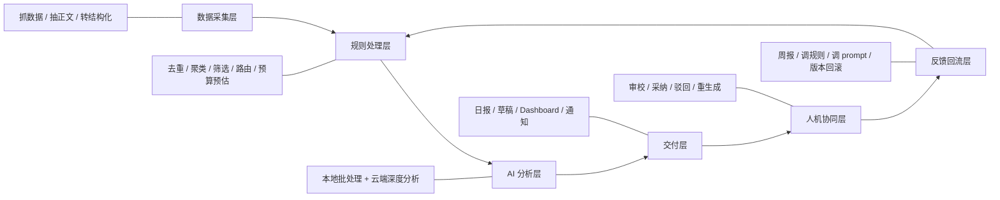
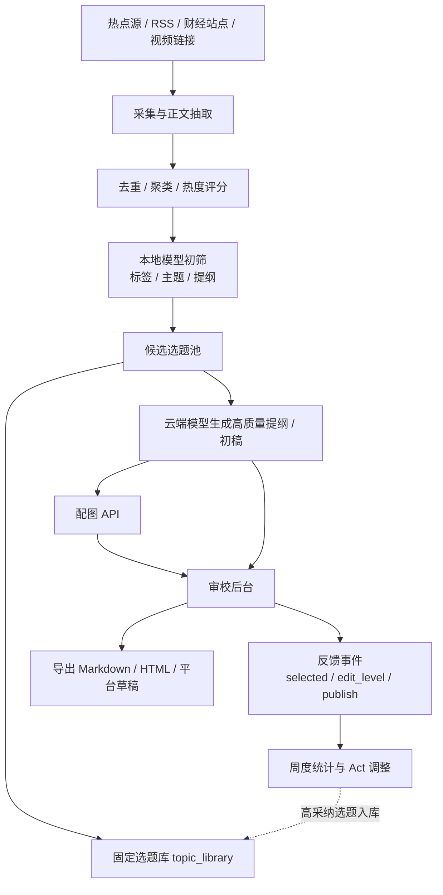
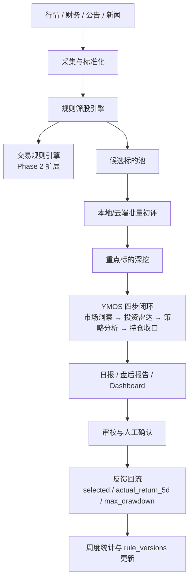
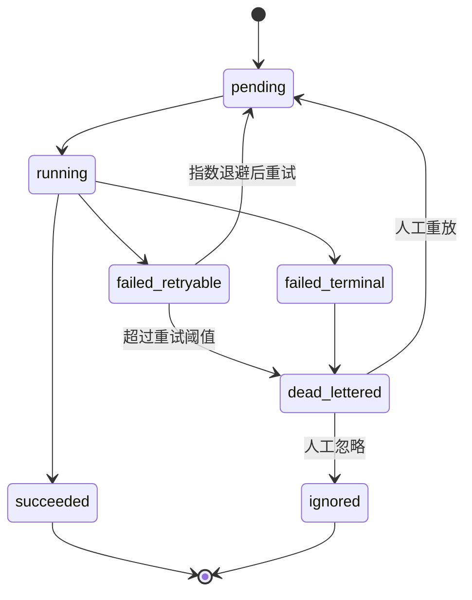
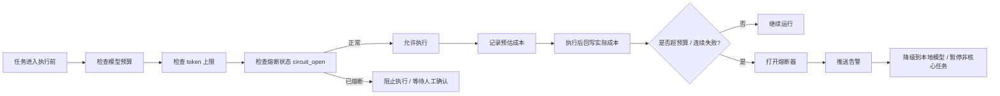
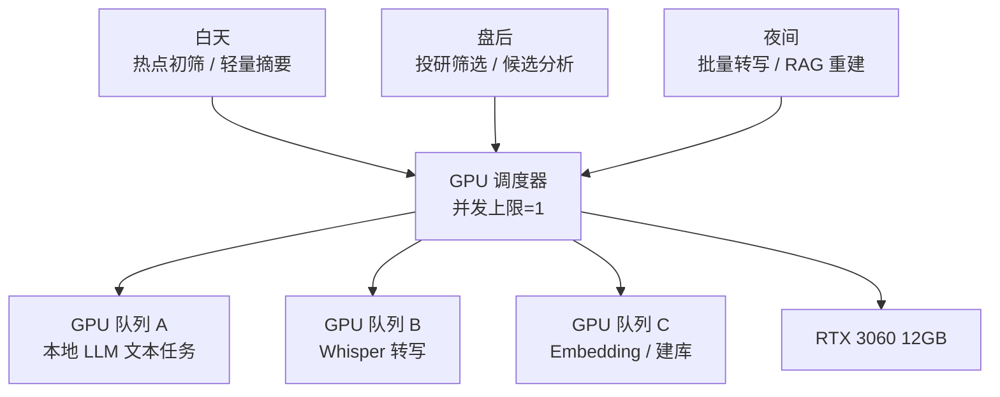
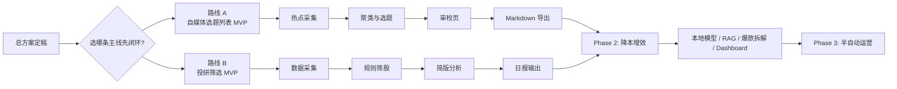
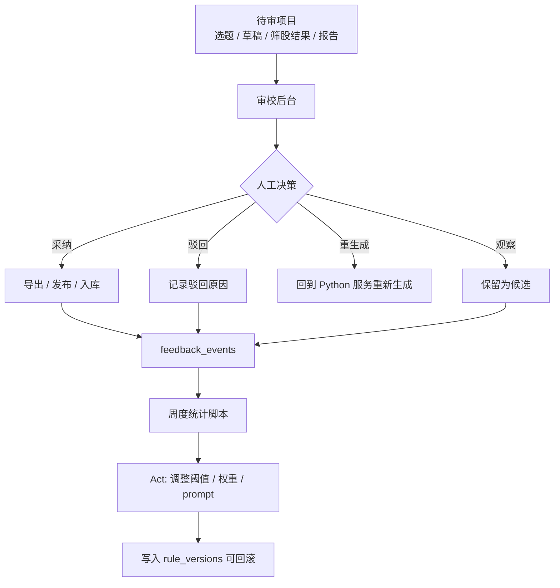

# 财经自媒体与投研自动化系统架构图（v1）

> 配套主文档：`docs/superpowers/plans/2026-03-30-finance-media-research-automation-architecture.md`
> 用途：用于沟通系统边界、数据流、任务流和 MVP 先后顺序。

---

## 1. 系统总体架构图

```mermaid
flowchart TB
    U[用户 / 审校人] --> R[审校后台\nStreamlit / Web UI]
    U --> N8N[n8n 调度中心]

    N8N --> API[Python / FastAPI 服务层]
    R --> API

    subgraph Data[数据采集层]
        DS1[财经资讯源\n新浪/东财/同花顺/RSS]
        DS2[投研数据源\nTushare/AkShare/公告/财务]
        DS3[视频/图文素材源]
    end

    WA[OpenClaw web-access 技能\n复杂联网增强层]

    DS1 --> API
    DS2 --> API
    DS3 --> API
    DS1 -.复杂网页/动态站点.-> WA
    DS3 -.登录态/交互站点.-> WA
    WA --> API

    subgraph Rule[规则处理层]
        RP1[清洗/去重/聚类]
        RP2[规则筛选/公告分类]
        RP3[token 预算预估\n上下文裁剪]
    end

    API --> RP1
    API --> RP2
    API --> RP3

    subgraph AI[AI 分析层]
        LLM_LOCAL[本地模型\nOllama + Qwen2.5-7B]
        ASR[本地转写\nfaster-whisper]
        LLM_CLOUD[云端模型 API\nGemini / GPT / DeepSeek]
        IMG[图像 API\n豆包 / Gemini / Flux]
    end

    RP1 --> LLM_LOCAL
    RP1 --> ASR
    RP2 --> LLM_CLOUD
    RP3 --> LLM_CLOUD
    RP3 --> LLM_LOCAL

    subgraph Store[存储层]
        DB[(SQLite / PostgreSQL)]
        VDB[(ChromaDB)]
        FILES[(原文/转写/报告文件)]
    end

    API --> DB
    API --> VDB
    API --> FILES
    LLM_LOCAL --> API
    ASR --> API
    LLM_CLOUD --> API
    IMG --> API

    subgraph Delivery[交付层]
        OUT1[自媒体选题 / 草稿 / 配图]
        OUT2[投研筛股 / 日报 / YMOS 报告]
        OUT3[通知推送\n飞书/企微/Telegram]
    end

    API --> OUT1
    API --> OUT2
    API --> OUT3

    subgraph Observe[监控与控制层]
        METRICS[/metrics]
        DLQ[DLQ / 重试队列]
        BUDGET[预算 / 熔断器]
        LOGS[结构化日志 / trace_id]
    end

    API --> METRICS
    API --> DLQ
    API --> BUDGET
    API --> LOGS
    N8N --> DLQ
    N8N --> BUDGET
```

---

## 2. 分层职责图



---

## 3. 财经自媒体数据流图



---

## 4. 金融投研数据流图



---

## 5. 任务流图（异步任务状态机）



---

## 6. 成本与熔断控制图



---

## 7. GPU 调度图



---

## 8. MVP 先后顺序图



---

## 9. 审校与回流图



---

## 10. 图文档使用建议

### 对老板 / 合作者沟通优先看
1. 系统总体架构图
2. 财经自媒体数据流图
3. 金融投研数据流图
4. MVP 先后顺序图

### 对开发实现优先看
1. 分层职责图
2. 任务流图（状态机）
3. 成本与熔断控制图
4. GPU 调度图
5. 审校与回流图

### 对后续实施的意义
- 主文档负责原则与约束
- 图文档负责边界和路径
- 两者一起，基本可以进入 MVP 实施计划拆分阶段
