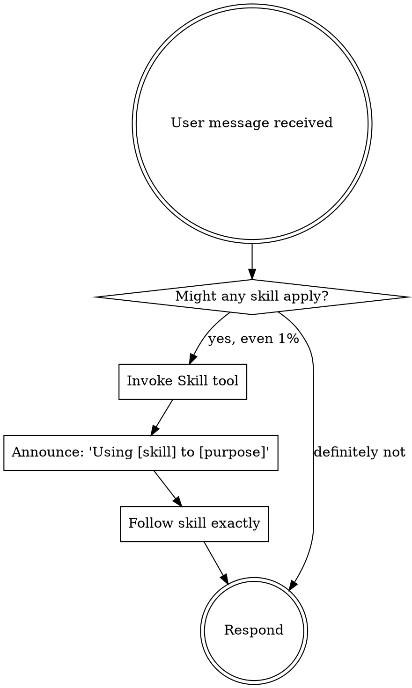

# Using Superpowers：使用超能力

## 概述

技能（Skills）是 AI 的工具箱——每当你需要完成特定类型的任务时，AI 自动调用对应的 Skill，确保工作方式规范、一致、不遗漏关键步骤。

## 技能入口规则 | The Skill Invocation Rule

**在任何响应或行动之前调用相关或请求的 skills。** 即使只有 1% 的可能性某个 skill 适用，也应该调用它来检查。

## 规则优先级 | Instruction Priority

用户指令优先级最高：
1. **用户明确指令**（CLAUDE.md、GEMINI.md、AGENTS.md、直接请求）——最高优先级
2. **Superpowers skills**——在冲突时覆盖默认系统行为
3. **默认系统提示**——最低优先级

## 触发思考停止 | Red Flags

这些想法意味着停——你在合理化：

| 想法 | 现实 |
|------|------|
| "这只是一个简单问题" | 问题就是任务。检查 skills。 |
| "我需要先获取更多上下文" | 检查 skills 在澄清问题之前。 |
| "我可以快速查看 git/文件" | 文件缺乏对话上下文。先检查 skills。 |
| "我知道这个 skill 是什么" | Skills 会进化。读取当前版本。 |
| "这不需要正式 skill" | 如果 skill 存在，使用它。 |
| "skill 有点大材小用" | 简单的事情会变复杂。使用它。 |

## 技能类型 | Skill Types

**刚性（discipline-enforcing）：** 如 TDD、调试——严格遵循，不要调整。

**灵活：** 如 patterns——根据上下文调整原则。

技能本身告诉你它是哪种。

## 何时使用 | When to Use

- 任何创意/功能工作 → brainstorming（硬门槛！）
- 遇到 Bug → systematic-debugging
- 声称完成 → verification-before-completion
- 有实施计划 → executing-plans 或 subagent-driven-development
- A股数据 → tushare-data
- 实时舆情 → grok-search
- 官方文档 → exa-search
- 网页访问 → web-access

## 用户指令

用户指令说 WHAT，不说 HOW。"添加 X"或"修复 Y"不意味着跳过工作流。
